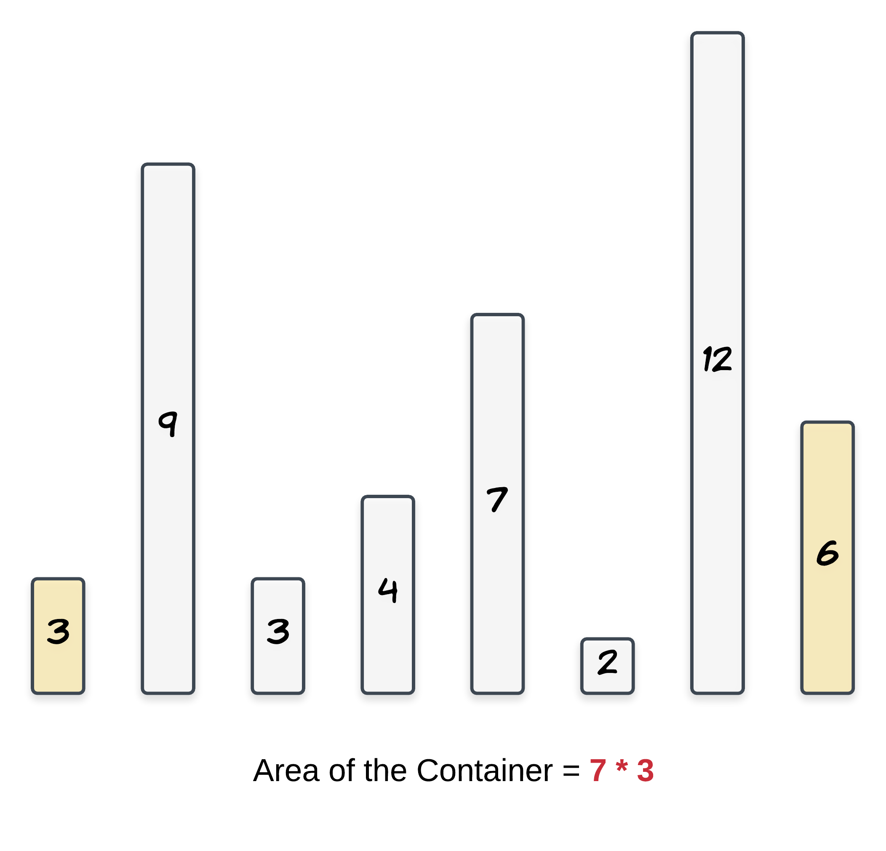
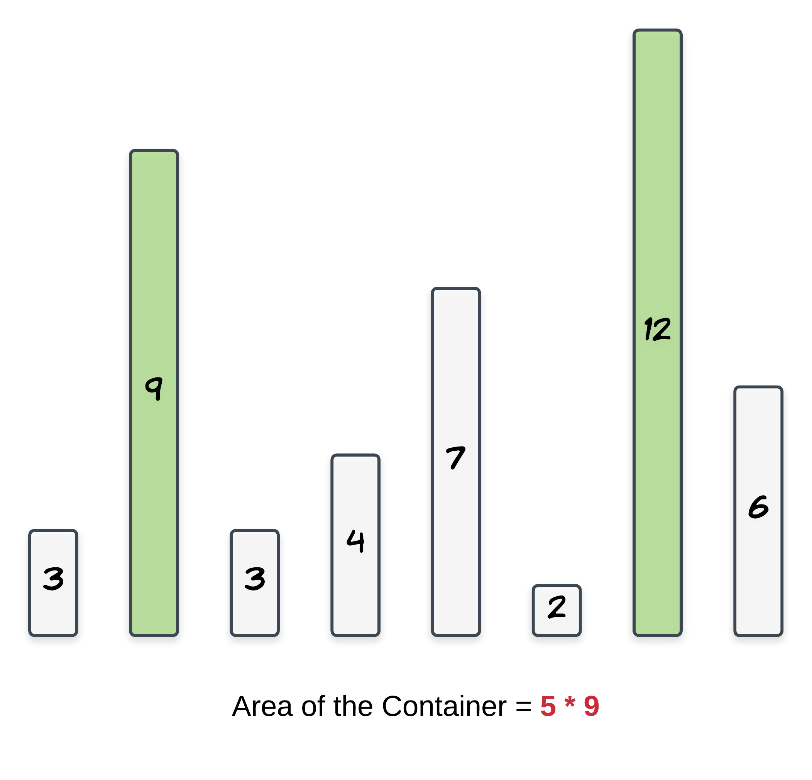

# Container With Most Water

You are given an integer array height of length n. There are n vertical lines drawn such that the two endpoints of the i<sup>th</sup> line are (i, 0) and (i, height[i]).

Find two lines that together with the x-axis form a container, such that the container contains the most water.

Return the maximum amount of water a container can store.

Notice that you may not slant the container.

## Example 1:


```
Input: height = [1,8,6,2,5,4,8,3,7]
Output: 49
Explanation: The above vertical lines are represented by array [1,8,6,2,5,4,8,3,7]. In this case, the max area of water (blue section) the container can contain is 49.
```

## Example 2:

```
Input: height = [1,1]
Output: 1
```

## Constraints:

- n == height.length
- 2 <= n <= 105
- 0 <= height[i] <= 104

<details>
<summary>Hint #1</summary>
The aim is to maximize the area formed between the vertical lines. The area of any container is calculated using the shorter line as length and the distance between the lines as the width of the rectangle.

```
Area = length of shorter vertical line * distance between lines
```

We can definitely get the maximum width container as the outermost lines have the maximum distance between them. However, this container <strong>might not be the maximum in size</strong> as one of the vertical lines of this container could be really short.




</details>

<details>
<summary>Hide Hint #2</summary>
Start with the maximum width container and go to a shorter width container if there is a vertical line longer than the current containers shorter line. This way we are compromising on the width but we are looking forward to a longer length container.
</details>
