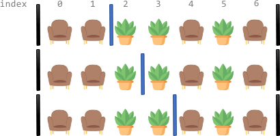

# Number of Ways to Divide a Long Corridor

Along a long library corridor, there is a line of seats and decorative plants. You are given a 0-indexed string corridor of length n consisting of letters 'S' and 'P' where each 'S' represents a seat and each 'P' represents a plant.

One room divider has already been installed to the left of index 0, and another to the right of index n - 1. Additional room dividers can be installed. For each position between indices i - 1 and i (1 <= i <= n - 1), at most one divider can be installed.

Divide the corridor into non-overlapping sections, where each section has exactly two seats with any number of plants. There may be multiple ways to perform the division. Two ways are different if there is a position with a room divider installed in the first way but not in the second way.

Return the number of ways to divide the corridor. Since the answer may be very large, return it modulo 109 + 7. If there is no way, return 0.

## Example 1:



```
Input: corridor = "SSPPSPS"
Output: 3
Explanation: There are 3 different ways to divide the corridor.
The black bars in the above image indicate the two room dividers already installed.
Note that in each of the ways, each section has exactly two seats.
```

## Example 2:


```
Input: corridor = "PPSPSP"
Output: 1
Explanation: There is only 1 way to divide the corridor, by not installing any additional dividers.
Installing any would create some section that does not have exactly two seats.
```

## Example 3:


```
Input: corridor = "S"
Output: 0
Explanation: There is no way to divide the corridor because there will always be a section that does not have exactly two seats.
```

## Constraints:

- n == corridor.length
- 1 <= n <= 10^5
- corridor[i] is either 'S' or 'P'.
