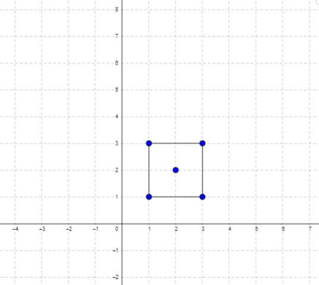

# Minimum Area Rectangle

You are given an array of points in the X-Y plane points where points[i] = [x<sub>i</sub>, y<sub>i</sub>].

Return the minimum area of a rectangle formed from these points, with sides parallel to the X and Y axes. If there is not any such rectangle, return 0.

## Example 1:



```
Input: points = [[1,1],[1,3],[3,1],[3,3],[2,2]]
Output: 4
```

## Example 2:


```
Input: points = [[1,1],[1,3],[3,1],[3,3],[4,1],[4,3]]
Output: 2
```

## Constraints:

- 1 <= points.length <= 500
- points[i].length == 2
- 0 <= x<sub>i</sub>, y<sub>i</sub> <= 4 \* 10<sup>4</sup>
- All the given points are unique.
