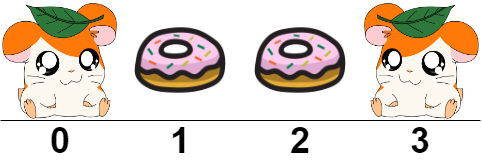

# Minimum Number of Food Buckets to Feed the Hamsters

You are given a 0-indexed string hamsters where hamsters[i] is either:

'H' indicating that there is a hamster at index i, or
'.' indicating that index i is empty.
You will add some number of food buckets at the empty indices in order to feed the hamsters. A hamster can be fed if there is at least one food bucket to its left or to its right. More formally, a hamster at index i can be fed if you place a food bucket at index i - 1 and/or at index i + 1.

Return the minimum number of food buckets you should place at empty indices to feed all the hamsters or -1 if it is impossible to feed all of them.

## Example 1:



```
Input: hamsters = "H..H"
Output: 2
Explanation: We place two food buckets at indices 1 and 2.
It can be shown that if we place only one food bucket, one of the hamsters will not be fed.
```

## Example 2:


```
Input: hamsters = ".H.H."
Output: 1
Explanation: We place one food bucket at index 2.
```

## Example 3:


```
Input: hamsters = ".HHH."
Output: -1
Explanation: If we place a food bucket at every empty index as shown, the hamster at index 2 will not be able to eat.
```

## Constraints:

- 1 <= hamsters.length <= 10^5
- hamsters[i] is either'H' or '.'.
